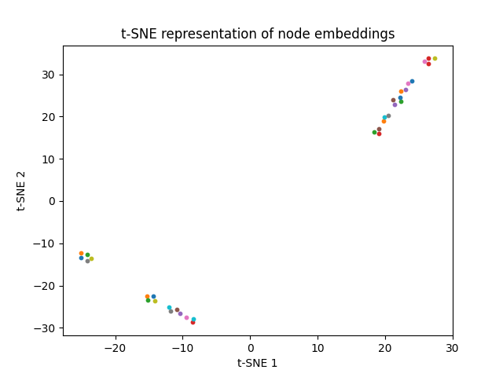
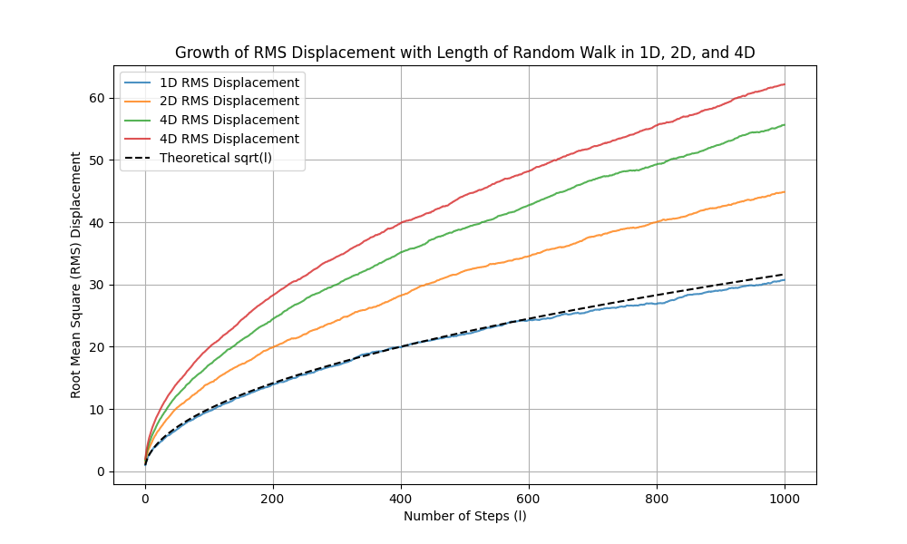

This repository contains implementations and simulations related to graph neural networks and random walks in multiple dimensions.

## Node2Vec Algorithm

The `node2vec.ipynb` notebook demonstrates the Node2Vec algorithm for generating node embeddings in a graph. Node2Vec is a scalable feature learning technique for networks, which maximizes the likelihood of preserving network neighborhoods of nodes.

### t-SNE Visualization of Node Embeddings

The notebook includes a t-SNE visualization of the node embeddings generated by the Node2Vec algorithm. The t-SNE algorithm reduces the dimensionality of the embeddings to 2D for visualization purposes.

In the plot above, each point represents a node in the graph, and similar nodes are grouped together. The legend shows the labels of the nodes.

## Random Walk Simulations

The `rms_growth_with_l.ipynb` notebook simulates random walks in 3D and 4D spaces and calculates the root mean square (RMS) displacement. The notebook includes visualizations of the random walks and the growth of RMS displacement over time.

### RMS Displacement Growth

The plot above shows the growth of RMS displacement over time for both 3D and 4D random walks. The RMS displacement is a measure of the average distance from the origin after a certain number of steps.

## Conclusion

This repository provides a comprehensive overview of the Node2Vec algorithm for node embeddings and random walk simulations in higher dimensions. The visualizations help in understanding the behavior of nodes in a graph and the properties of random walks.

## Acknowledgments

- The Node2Vec algorithm is based on the paper ["node2vec: Scalable Feature Learning for Networks"](https://snap.stanford.edu/node2vec/).
- Random walk simulations are inspired by various sources in statistical mechanics and computational physics.